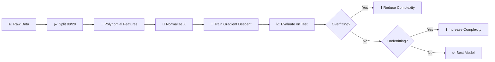

<div align="center" class="text-center">
  <h1>42-Bootcamp_AI</h1>
  
  
  
  
  <p><em>Built with the tools and technologies:</em></p>
  
  
  
</div>

<h2>Table of Contents</h2>
<ul class="list-disc pl-4 my-0">
  <li class="my-0"><a href="#get-started">Get started</a></li>
  <ul class="list-disc pl-4 my-0">
    <li class="my-0"><a href="#instal-the-project">Install the project</a></li>
    <li class="my-0"><a href="#install-the-correct-environment">Install the correct environment</a></li>
  </ul>
  <li class="my-0"><a href="#theoretical-concepts">Theoretical concepts</a></li>
  <ul class="list-disc pl-4 my-0">
    <li class="my-0"><a href="#multivariate-linear-regression">Multivariate Linear Regression</a></li>
    <li class="my-0"><a href="#logistic-regression">Logistic Regression</a></li>
  </ul>
</ul>

<h2>Get started</h2>

#### Install the project

```bash
git clone https://github.com/socallmebertille/42-Bootcamp_AI.git 42-Bootcamp_AI
cd 42-Bootcamp_AI
```

#### Install the correct environment

```bash
curl -LsSf https://astral.sh/uv/install.sh | sh # installation

source ~/.bashrc                                # restart home for bash
source ~/.zshrc                                 # restart for zsh

uv --version                                    # version check
uv python install 3.13                          # installation version python

uv venv                                         # creation
source .venv/bin/activate                       # activation

uv pip install numpy pandas jupyter ruff pytest # installation of dependancies

python your_script.py                           # use

deactivate                                      # desactivation
```

<h2>Theoretical concepts</h2>

### Multivariate Linear Regression

> **Objective:** Predict a target variable from multiple features using polynomial models and gradient descent.

---

#### 🎯 Key Concepts

```
Univariate:   ŷ = θ₀ + θ₁·x
Multivariate: ŷ = θ₀ + θ₁·x₁ + θ₂·x₂ + ... + θₙ·xₙ
Polynomial:   ŷ = θ₀ + θ₁·x + θ₂·x² + θ₃·x³ + ...
```

| Type | Number of Features | Example |
|------|-------------------|---------|
| **Univariate** | 1 | Price vs Time |
| **Multivariate** | n ≥ 2 | Price vs Weight, Distance, Time |
| **Polynomial** | Powers of a feature | x, x², x³, ... |

---

#### 📐 Mathematical Formulas

**Hypothesis (Prediction)**
```
h(X) = X' · θ
where X' = [1, x₁, x₂, ..., xₙ]  (with column of ones)
      θ = [θ₀, θ₁, θ₂, ..., θₙ]ᵀ
```

**Cost Function (MSE)**
```
J(θ) = 1/m · Σ(ŷᵢ - yᵢ)²
```

**Gradient**
```
∇J(θ) = 1/m · X'ᵀ · (X'·θ - Y)
```

**Gradient Descent**
```
θ_new = θ_old - α · ∇J(θ)
```

> **α (alpha)**: Learning rate  
> **m**: Number of examples  
> **X'**: Feature matrix with column of ones


#### 🔄 Standard ML Pipeline



---

#### ⚖️ Underfitting vs Overfitting

| Phenomenon | Train MSE | Test MSE | Cause | Solution |
|-----------|-----------|----------|-------|----------|
| **Underfitting** | 🔴 High | 🔴 High | Model too simple | ⬆️ Increase complexity |
| **Sweet Spot** | 🟢 Low | 🟢 Low | Good balance | ✅ Keep it! |
| **Overfitting** | 🟢 Very low | 🔴 High | Model too complex | ⬇️ Reduce complexity |

**Visualization**

```
MSE
 │
 │  Test ──────╮
 │            │ ╲
 │            │  ╲  ← Overfitting zone
 │   Train ───┼───╲___
 │           ╱     ╲
 │          ╱   ✅  ╲
 │         ╱         ╲___
 │        ╱               ╲___
 └────────────────────────────► Complexity
     Underfitting    Optimal   Overfitting
```

---

#### 🛠️ Essential Techniques

1. **Polynomial Features**
```python
X = [x₁, x₂]
     ↓ degree=2
X_poly = [x₁, x₁², x₂, x₂², x₁·x₂]
```

2. **Normalization (Z-score)**
```python
X_norm = (X - μ) / σ

μ = mean
σ = standard deviation
→ Result: μ=0, σ=1
```

> **Why?** Speeds up convergence, prevents overflow

3. **Train/Test Split**
```
📊 Dataset (100%)
    ├─ 80% Train → Training
    └─ 20% Test  → Evaluation (unseen data)
```

---

#### 📊 Evaluation Metrics

| Metric | Formula | Interpretation |
|----------|---------|----------------|
| **MSE** | `1/m · Σ(ŷ - y)²` | Mean Squared Error |
| **RMSE** | `√MSE` | Same unit as Y |
| **MAE** | `1/m · Σ|ŷ - y|` | Mean Absolute Error |
| **R²** | `1 - (SS_res/SS_tot)` | % variance explained (0-1) |

---

#### 💻 Code Structure

```python
# 1. Load & Split
X, Y = load_data()
Xtrain, Xtest, Ytrain, Ytest = data_spliter(X, Y, 0.8)

# 2. Polynomial Features
X_poly = add_polynomial_features(Xtrain, degree=3)

# 3. Normalize
X_norm = zscore(X_poly)

# 4. Train
theta = np.ones((n_features + 1, 1))
lr = MyLR(theta, alpha=1e-3, max_iter=100000)
lr.fit_(X_norm, Ytrain)

# 5. Evaluate
y_pred = lr.predict_(X_test_norm)
mse = lr.mse(y_pred, Ytest)
```

> 💡 **Tip:** Always normalize X (not Y), always split train/test, always compare train/test MSE to detect overfitting!

---

### Logistic Regression

> **Objective:** Predict a category/label/cass variable with a classification algorithm.

---

#### 🎯 Key Concepts

